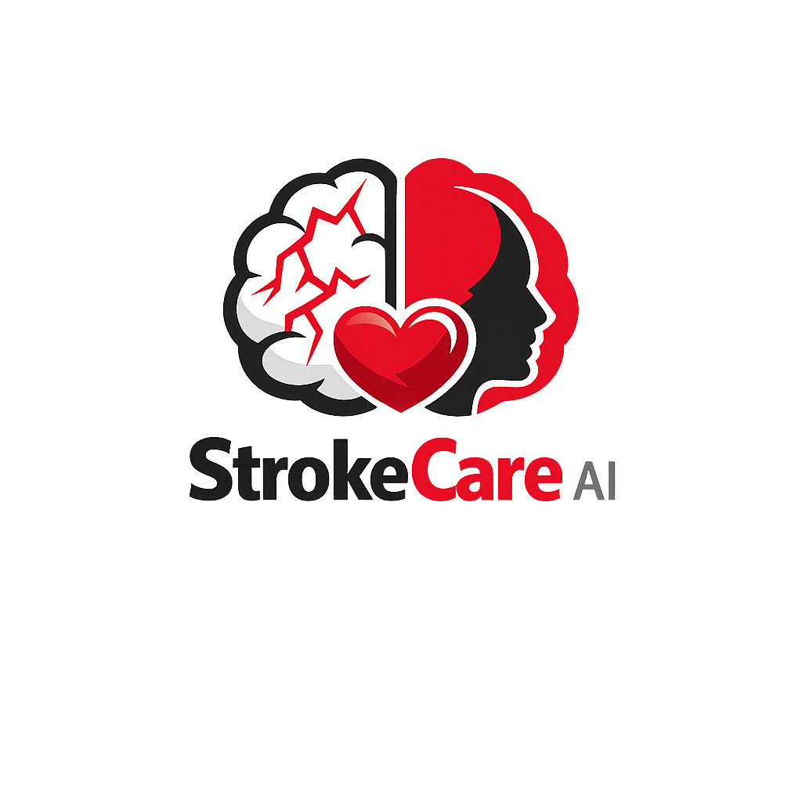

<p align="center">
  
</p>

# StrokeCare AI

StrokeCare AI is a health education and companion platform that helps the community recognize stroke symptoms early, understand personal risk factors, and access easily understandable information through an AI Companion.

Unlike diagnostic applications, StrokeCare AI focuses on **awareness, education, and prevention**, empowering users to understand their condition and take appropriate actions before it is too late.

---

# Problem Statement

Stroke is one of the leading causes of death and disability worldwide.

However, many people still:

- Do not understand the early symptoms of a stroke.
- Mistake stroke symptoms for common conditions like fatigue or catching a cold.
- Are unaware of their own personal risk factors.
- Do not understand the connection between lifestyle and stroke risk.
- Struggle to find health information that is easy to understand.
- Only seek professional help when their condition has already worsened.

As a result, many stroke cases are recognized too late, leading to suboptimal treatment.

StrokeCare AI is here to help users recognize risks and understand stroke earlier through an educational and personalized approach.

---

# Features

## Stroke Awareness (Kenali Stroke)

An interactive education page that helps users understand the progression of stroke symptoms from the early stages up to emergencies.

This feature uses a visual storytelling experience to make the information much easier to grasp than typical health articles.

### Covered Topics

- What is a stroke?
- Early symptoms of a stroke
- Condition changes to watch out for
- Stroke risk factors
- The impact of delayed treatment
- Basic prevention information

---

## Personal Health Profile

Before using the AI Companion, users are required to complete a personal health profile.

### Collected Information

- Age
- Gender
- Height
- Weight
- History of hypertension
- History of diabetes
- History of high cholesterol
- Smoking habits
- Physical activity level

This data is used to help the AI provide more relevant and personalized responses.

---

## AI Companion

An AI assistant that helps users understand their health and stroke risks based on their personal profile.

The AI Companion does not replace medical professionals and does not provide medical diagnoses.

### Example Questions

- Is my age at risk for a stroke?
- What is the connection between hypertension and stroke?
- How can I lower my stroke risk?
- Is my weight ideal?
- What foods are good for blood vessel health?

---

## Stroke Knowledge Base

The central information hub used by the AI to provide accurate and consistent answers.

Includes:

- Stroke education
- Risk factors
- Prevention
- Healthy lifestyle
- Post-stroke recovery
- Frequently Asked Questions (FAQs)

---

## Conversation History

Saves the user's conversation history with the AI Companion so the provided information retains context over time.

---

## Risk Factor Awareness

Helps users understand factors that can increase the risk of a stroke.

Examples:

- Hypertension
- Diabetes
- High cholesterol
- Obesity
- Lack of physical activity
- Smoking

The main focus of this feature is to raise user awareness of conditions that can trigger a stroke.

---

## Admin Management

Admins can manage all the data used by the system.

### Data Management

- Users
- Risk factors
- Symptoms
- Educational articles
- Knowledge Base
- AI Prompt Configuration
- System activity history

---

# Goals

StrokeCare AI aims to:

- Increase public awareness of stroke.
- Help users recognize personal risk factors.
- Provide health education that is easy to understand.
- Encourage prevention before conditions become serious.
- Make health information more accessible through the AI Companion.

---

# System Architecture

This application is built using a Monorepo **Kana Stack** (Full-Stack TypeScript) architecture designed to be highly scalable using a *Clean/Hexagonal Architecture* approach.

## Core Technologies

| Layer | Technology |
|---|---|
| **Monorepo** | `moonrepo` + `pnpm` workspaces |
| **Backend (API)** | Hono, oRPC (RPC + OpenAPI), Drizzle ORM, better-auth, Redis |
| **Frontend (Web)** | React 19, TanStack Router (SPA), Vite, TailwindCSS v4, shadcn/ui |
| **Data Fetching** | TanStack Query + oRPC client (End-to-End Typed) |
| **Database** | PostgreSQL |
| **Caching** | Redis |
| **Linter / Formatter**| Biome |

## Monorepo Structure

- `apps/api`: The backend service containing *core logic*, *use cases*, and database interfaces. Isolated using a hexagonal architecture.
- `apps/web`: The Frontend Single Page Application (SPA) for the user interface, utilizing React and file-based routing.

---

# How to Run the System

## Prerequisites

Ensure you have installed the following software on your system:

- **Node.js** (v20.x or newer is recommended)
- **pnpm** (v9.x) - The package manager used
- **Docker & Docker Compose** (To run local PostgreSQL & Redis without manual installation)

## Steps

1. **Run Database & Redis**
   Ensure Docker Desktop/Daemon is running, then execute the following command to initialize PostgreSQL and Redis via `docker-compose`:
   ```bash
   docker-compose -f docker-compose.dev.yml up -d
   ```

2. **Install Dependencies**
   Install all required modules for the monorepo using `pnpm`:
   ```bash
   pnpm install
   ```

3. **Environment Configuration**
   Copy the `.env.example` file to `.env` in the root directory:
   ```bash
   cp .env.example .env
   ```
   *The `.env` file is already pre-configured with default variables for local development. It will automatically connect to both the frontend and backend.*

4. **Database Migration**
   Run the database schema push to the newly running PostgreSQL:
   ```bash
   pnpm run db:push
   ```

5. **Start the Development Server**
   Run both services (API & Web) concurrently through the root `moon` command:
   ```bash
   pnpm run dev
   ```

   Once the build process is complete, you can access:
   - **Frontend (Web App):** `http://localhost:5173`
   - **Backend (API Base URL):** `http://localhost:3001`

## Additional Commands

- **Format Code (Biome):**
  ```bash
  pnpm run format
  ```
- **Lint Code (Biome):**
  ```bash
  pnpm run lint
  ```
- **Open Drizzle Studio (Interactive Database GUI):**
  ```bash
  pnpm run db:studio
  ```